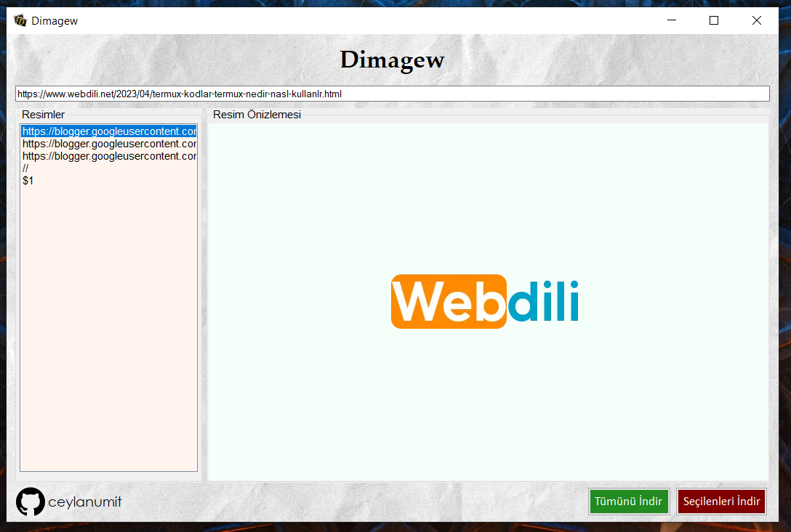

# Dimagew
Dimagew/Dimagew.PNG
Dimagew, web sayfalarından görüntü indirmeyi sağlayan bir Windows Forms uygulamasıdır.

## Kullanım

1. Programı başlatın.
2. URL kutusuna bir web sayfası URL'si girin.
3. Web sayfasından bulunan resimleri listelemesini bekleyin.
4. Listelenen resimlerden görüntüleri önizleyin.
5. "Seçileni İndir" düğmesine tıklayarak seçilen resmi indirin. || "Tümünü İndir" düğmesine tıklayarak tüm resimleri indirin.

## Ekran Görüntüsü

## Gereksinimler

- Windows işletim sistemi
- NET Framework 4.5 veya üstü

2024 [Dimagew]([https://github.com/LavaDo](https://github.com/ceylanumit/Dimagew)). Original creator: [@ceylanumit](https://github.com/ceylanumit)
